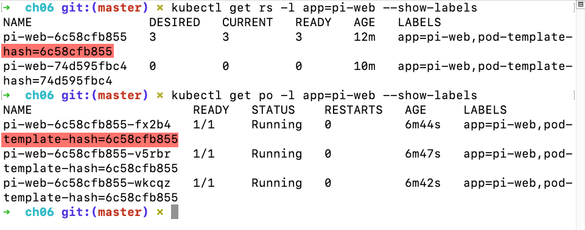

# Scaling Applications with ReplicaSets

Deployments don't manage Pods directly - that's done by another resource called a *ReplicaSet*. Change the scale of a ReplicaSet and it will add or remove Pods. If Pods disappear, the ReplicaSet replaces them.

The Deployment controls ReplicaSets; ReplicaSets control Pods.

The YAML for a ReplicaSet is similar to a Deployment - it needs a selector to identify the resources it owns and a Pod template to create resources.

```
apiVersion: apps/v1
kind: ReplicaSet
metadata:
  name: whoami-web
spec:
  replicas: 1
  selector:
    matchLabels:
      app: whoami-web
  template: ...

```

To find ReplicaSets, use `kubectl get replicaset` or `kubectl get rs`.

The ReplicaSet constantly runs a control loop, checking that the number of objects it owns matches the number of replicas specified. You scale your application by increasing the number of replicas in the specification.

When you scale up in a production cluster, it's likely that new Pods will be schedule to run on nodes that don't have the image locally. The nodes will need to pull the image before they can run the Pod. The speed at which you can scale is bounded by the speed at which your images can be pulle - this is why it's important to invest time in optimizing images.

With scaling, you run as many Pods as you need. They all sit behind one Service. When users access this Service, Kubernetes distributes the load between the Pods. The same networking layer that routes traffic to a Pod on any node can load-balance across multiple Pods.

## Scaling for Load

A Deployment is a controller for ReplicaSets. To run at scale, you include the same `replicas` field in the Deployment spec and that is passed to the ReplicaSet.

For example:

```
apiVersion: apps/v1
kind: Deployment
metadata:
  name: pi-web
spec:
  replicas: 2 # defaults to 1
selector:
  matchLabels:
    app: pi-web
  template: ...
```

The label selector for the Deployment needs to match the labels defined in the Pod template. Those labels are used to express the chain of ownership from Pod, to ReplicaSet, to Deployment.

When you scale a Deployment, it updates the existing ReplicaSet to the new number of replicas. However, if you change the Pod spec in the Deployment, it replaces the ReplicaSet and scales the previous one down to zero. The Deployment wait for the new ReplicaSet to be fully operational before completely scaling down the old one. That gives the Deployment a lot of control over how it manages the update and how it deals with any problems.

You can use the kubectl `scale` command as a shortcut for scaling controllers. This is an *imperative* way of working, though. It's much better to use *declarative* YAML files - this way, the state of your apps in production always matches the spec stored in source control (your source of truth).

```
kubectl scale --replicas=4 deploy/pi-web
```

If you undo an imperative scale by reapplying the previous specification, Kubernetes ressurects the original ReplicaSet - it doesn't create a new one. This improves efficiency.

Pods creatd from Deployments have a generated name that looks random, but it isn't! The Pod name contains a hash of the template in Pod spec for the Deployment. If you make a change to the spec that matches a previous Deployment, it will have the same template hash as a scaled-down ReplicaSet. The Deployment can find that ReplicaSet and scale it up again. This Pod template hash is stored in a label.

