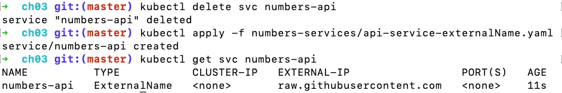

# Connecting Pods with Services

Most applications are distributed across multiple components, and you'd use a Pod for each component. In a typical microservice architecture, all those Pods need to communicated.

Kubernetes supports the standard networking protocols TCP and UDP. Both protocols use IP addressess to route traffic. However, Pods are ephemeral and IP addresses change when they are replaced. Kubernetes solves this problem with *Services*, a network address discovery mechanism.

Services support:

- Routing traffic between Pods.
- Routing external traffic into the Pods.
- Routing traffic from Pods to external systems.

A Kubernetes cluster has a built-in DNS server, which maps Service names to IP addresses. The Service is loosely coupled to the Pod using a label-selector approach.

This type of Service is an abstraction over a Pod and its network address, just as a Deployment is an abstraction over a Pod and its container.

The Service has its own IP address, which is static. When network requests are made to that address, Kubernetes routes it to the actual IP address of the Pod. The link between the Service and its Pods is achieved with a label selector, just like the link between Deployments and Pods.

Here is a simple specification for a Service:

```
apiVersion: v1
kind: Service
metadata:
  name: my-service
spec:
  selector:
    app: my-app
  ports:
    - port: 80
```

In the example above, the selector links all Pods with an app label of `my-app`. The Service name - `my-service` - is used as the DNS domain name.

## Routing Traffic Between Pods

The default Service type in Kubernetes is *ClusterIP*. It creates a clusterwide IP address that Pods on any node can access.

The IP address works only within the cluster, so ClusterIP Services are useful only for communicating *between* Pods. This is useful where you have components that shouldn't be accessible outside of the cluster.

The following example specification creates a Service with the ClusterIP type:

```
apiVersion: v1
kind: Service
metadata:
  name: numbers-api
spec:
  ports:
    - port: 80
  selector:
    app: numbers-api 
  type: ClusterIP

```

:notebook: As ClusterIP is the default Service type, it can be omitted from the specification. However, including the type makes it clearer.

## Routing External Traffic to Pods

A *LoadBalancer* solves the problem of getting traffic to a Pod that might be running on a different node form the one that received the traffic.

- A LoadBalancer Service integrates with an external load balancer, which sends traffic to the cluster.
- The Service sends the traffic to a Pod, using the label-selector mechanism to identify a target Pod.
- The Service spans the entire cluster, so any node could receive traffic.

Here is a simple LoadBalancer Service specification:

```
apiVersion: v1
kind: Service
metadata:
  name: numbers-web
spec:
  ports:
    - port: 8080 
      targetPort: 80
  selector:
    app: numbers-web
  type: LoadBalancer
```

The Service above listens on port 8080 and sends traffic to the web Pod on port 80. When you deploy it, you'll be able to use the web app without setting up a port forward in kubectl.

The following command obtains the app URL:

`kubectl get svc numbers-web -o jsonpath='http://{.status.loadBalancer.ingress[0].*}:8080'`

There's another Service type you can use. The *NodePort* listens for network traffic coming into the cluster and directs it to a Pod. 

NodePort Services don't require an external load balancer - every node in the cluster listens on the port specifie in the Service and sends traffic to the target port on the Pod.

NodePort Services aren't as flexibile as LoadBalancer Services. Because you need a different port for each Service, your nodes need to be publicly accessible and you don't achieve load-balancing across a multinode cluster.

:warning: You typically don't use NodePorts in production.

## Routing Traffic Outside Kubernetes

Although you can run almost anything in Kubernetes, you'd probably want to run databases outside of your cluster. You can still using Kubernetes Services for domain name resolution to external components.

*ExternalName Services* allow you to use local names in your application Pods. The DNS server in Kubernetes then resolves the local name to a fully qualified external name when the Pod makes a lookup request. It's like an alias from one domain to another.

For example, a Pod could use the local cluster name `db-service` which the Kubernetes DNS server resolves to the public address `app.mydatabase.io`.

```
apiVersion: v1
kind: Service
metadata:
  name: numbers-api
spec:
  type: ExternalName
  externalName: raw.githubusercontent.com
```



Kubernetes implements ExternalName Services using a standard feature of DNS: canonical names (CNAMES). When the web Pod makes a DNS lookup for the `numbers-api` domain name, the Kubernetes DNS server returns the CNAME, which is raw.githubeusercontent.com. Then the DNS resolution finds the IP address of the GitHub servers.

## Understanding Kubernetes Service resolution

All communication from Pods is routed by a network proxy called `kube-proxy`, another internal Kubernetes component. A kube-proxy runs on each node. It maintains an updated list of endpoints for each Service and routes traffic.

### Namespaces

Every Kubernetes resource exists within a *namespace*, which is used for grouping resources. Namespaces provide a method of logically partitioning a Kubernetes cluster. For example, you could create namespaces for separate teams or products.

Within a namespace, Services are availabl ueins a simple domain name, for example, `numbers-api`.

Services are also accessible using a full qualified domain name, which includes the namespace of the service. Pods in other namespaces can access that Service with a name in the format of `numbers-api.default.svc.cluster.local`.

If you don't specify a namespace, any resources you create are added to the *default* namespace. 

Internal Kubernetes components, such as the DNS server and the Kubernetes API, run Pods in the `kube-system` namespace.

You can use the namespace flag to work with resources outside the default namespace:

```
kubectl get svc -n kube-system
```

## Deleting Services

Whereas deleting a Deployments also deletes all its Pods, there's no cascading delete for Services. They are independent objects that need to be removed separately.

To delete Deployments:

```
kubectl delete deploy --all
```

To delete Services:

```
kubectl delete svc --all
```

Then check what's still running:

```
kubectl get all
```

### Key Points

- In Kubernetes, you deploy a Service resource and use the name of the Service as the domain name for components to communicate. You don't use a Pod IP address directly.
- Any time you update a component of your app, you're replacing Pods. The Service abstraction keeps apps communicating through these replacements.